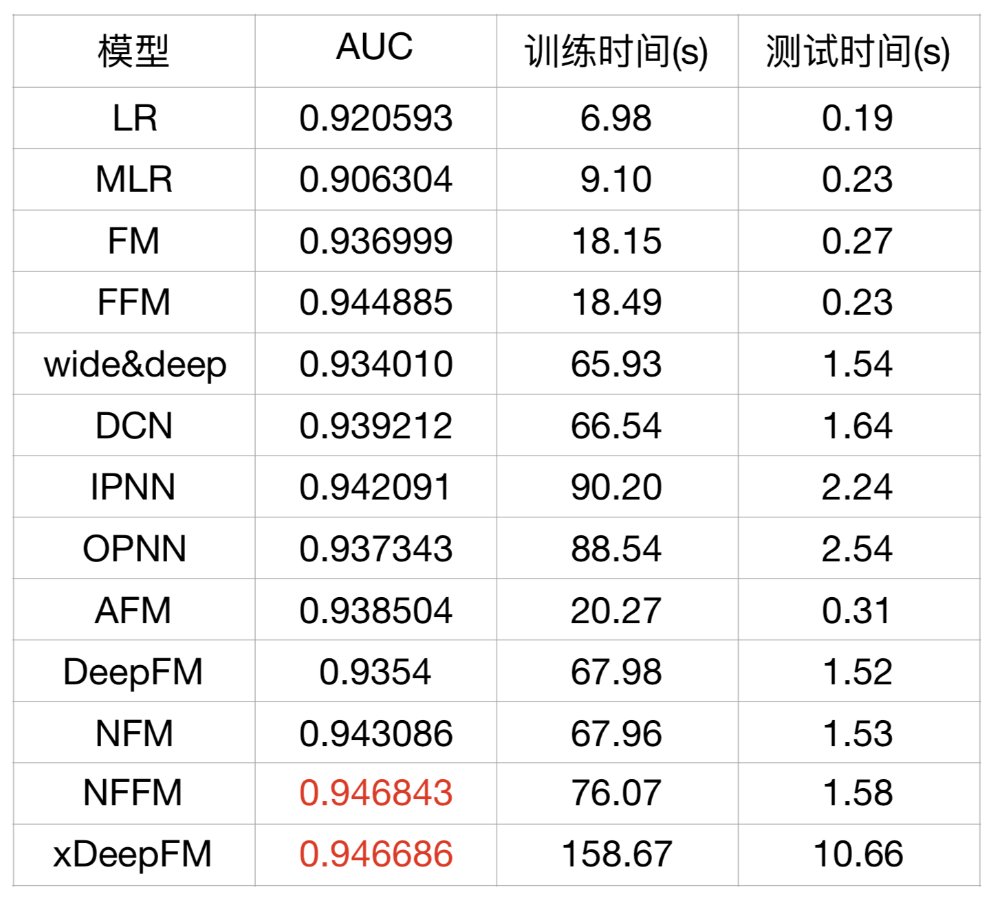
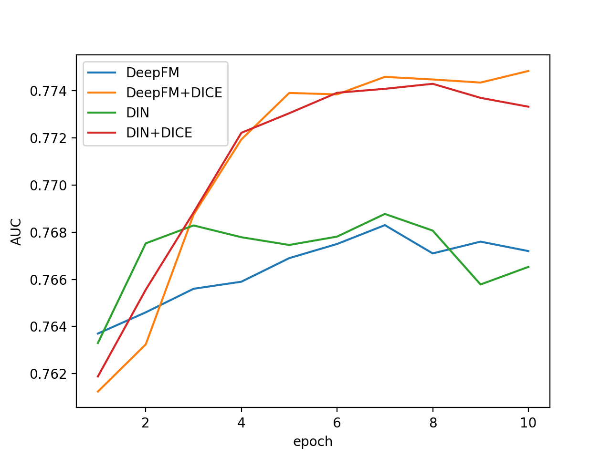

#DeepCTR practice

##简介
此为本人在学习tensorflow和CTR的时候做的小项目，计划基于tensorflow实现部分deepCTR模型，并在movielen数据集上进行简单的实验。在这个过程中较多的学习并参考了以下两处代码，在此表示感谢！

[DeepFM](https://github.com/ChenglongChen/tensorflow-DeepFM)

[princewen](https://github.com/princewen/tensorflow_practice)

除DIN以外，所有的模型均仅使用tags.csv文件构建的数据集，基于tags.csv文件生成数据集的代码存放data目录之下，仅使用三个字段，依次是userId, movieId, tag。与对原数据进行一定的负采样构成数据集，其中80%作为训练机，20%作为测试集。预测的结果可解释为该用户给该电影打上相应的标签的概率。

在实现DIN时发现上述数据可能不太合适，于是使用了ratings文件，用户给电影评分不低于四分的为正例，反之为负例。对于用户实力行文，考虑到有的用户的历史行为实在太多，所以根据时间顺序，仅保留最近的10项历史行为记录。每一个用户，按照每一条记录产生的时间戳信息，其前75%的记录构成训练集，后25%构成测试集。生成相应的数据存放于ratings文件夹之下。注意生成数据用到了pyspark，所以请运行

```
spark-submit read_data.py
python merge.py
```
以生成数据。

由于硬件条件有限，仅使用了前30000名用户的记录生成数据。

所有的实验都是在MacBook Pro上进行的。

##模型参数 & 结果对比

#### embedding_size:
NFFM、FFM : 4
others : 8
#### learning_rate: 0.0001

#### 全连接 : [200, 200, 200]

### 结果对比



### DIN vs DeepFM



以上所有的结果有没有进行精准的调参，所以结果并不能完全反映模型的强弱。此外模型的好坏也要看与数据集是否适合，所以参考参考就好。


